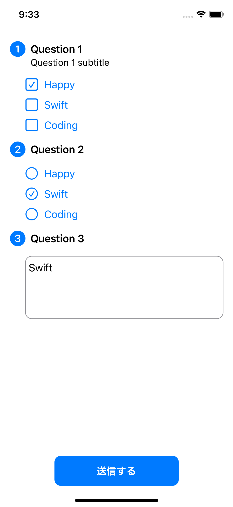

# Question

```
[
    {
        "title": "Question 1",
        "subtitle": "Question 1 subtitle",
        "option": {
            "selection": [
                "Happy",
                "Swift",
                "Coding"
            ],
            "placeholder": [
                "Happy"
            ]
        }
    },
    {
        "title": "Question 2",
        "option": {
            "selection": [
                "Happy",
                "Swift",
                "Coding"
            ],
            "placeholder": "Swift"
        }
    },
    {
        "title": "Question 3",
        "option": {
            "selection": null,
            "placeholder": "Swift"
        }
    }
]
```


